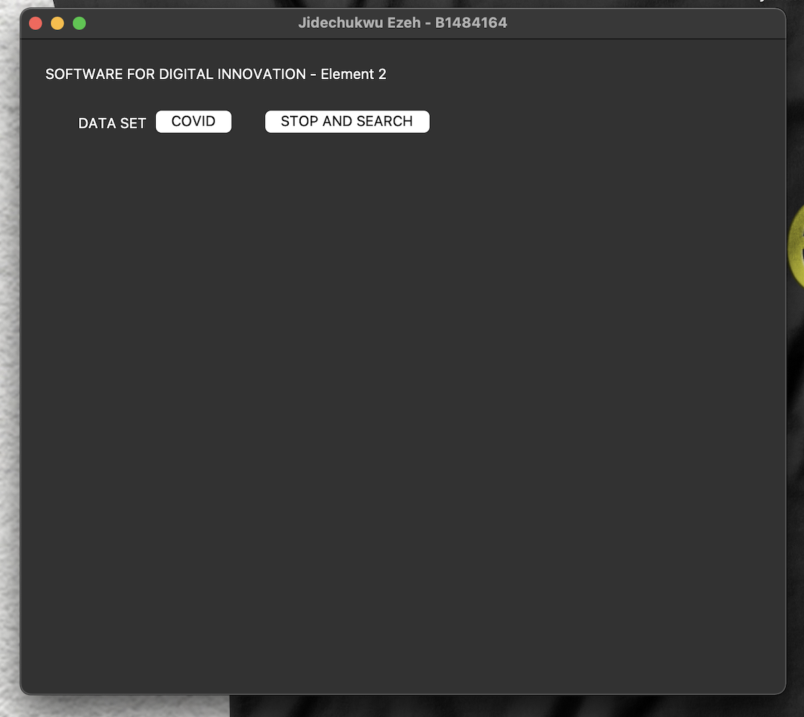

<!-- 
    As part of the in-course assessment (ICA) for Software for Digital Innovation, EZEH JIDECHUKWU has submitted this project to the School of Computing, Engineering and Digital Technologies. This project was build with the help of python and it's frameworks. 
-->

Getting Started:

It is important to mention that this project supports **Python Version 3 upwards** running this on a lower version might result in certain problems. Ensure to only use **Python Version 3 upwards**

Installation

Step 1:

Installation of python version used (Python 3) - Python can be downloaded from the official python website which is https://www.python.org/downloads/. Ensure to download a python interpreter that suits your device. **For MacOs users** it is not advisable to work with the default python that comes with the system please upgrade.

Step 2:

Installation of Python packages and it's versions - The requirement.txt file in the project folder contains a list of the necessary packages and their related versions. Open the project folder in **Command Prompt** and type the following command `python -m pip install -r requirement.txt`. This will install all the packages and their versions used during the development of this project. **For MacOs users** use `python3 -m pip install -r requirement.txt`. 

Step 3:

Starting the GUI - To start the GUI application, Open the project folder in **Command Prompt** and type `python -m main_app`.**For MacOs users** use `python3 -m main_app`. This should start the application as seen in the image attached 

The following visualisations are contained in the project:

Covid  -  

⊛ Total cases per day over a given period 
⊛ Total cases per month over a given period 
⊛ Total cases on a given day 
⊛ Areas with highest percentage change in cases on a given day 
⊛ Comparison of cases in two areas per day 

Stop and Search  - 

⊛ Stop and search cases gender 
⊛ Stop and search result by age range that resulted in arrest 
⊛ Stop and search cases by officer defined ethnicity 
⊛ Stop and search cases by legislation 
⊛ Type of stop and search cases 
⊛ Outcome of stop and search cases 

Unit testing

The unit tests used for this project are contained in the **test_app.py**. The procedures shown below describe how to run the unit tests used for this project and determine the test coverage for the application.

Step 1:

Open the project folder in **Command Prompt** and type `python -m test_app`. **For MacOs users** type `python3 -m test_app`, this executes each test present in the project. 

Step 2: To check for test coverage, Open the project folder in **Command Prompt** 

1. To perform coverage for all tests, enter the command `python -m coverage run -m unittest discover`.  **For MacOs users** use `python3 -m coverage run -m unittest discover`, This executes every test and determines the coverage. 
    
2. Enter `python -m coverage report -m` to report the coverage in the command prompt. Use the command `python3 -m coverage report -m` on a **Mac** to find out how much test coverage was done.